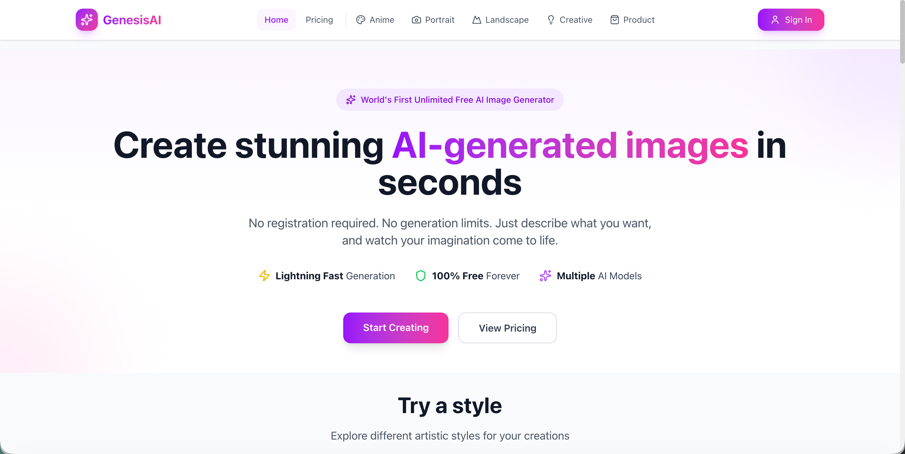
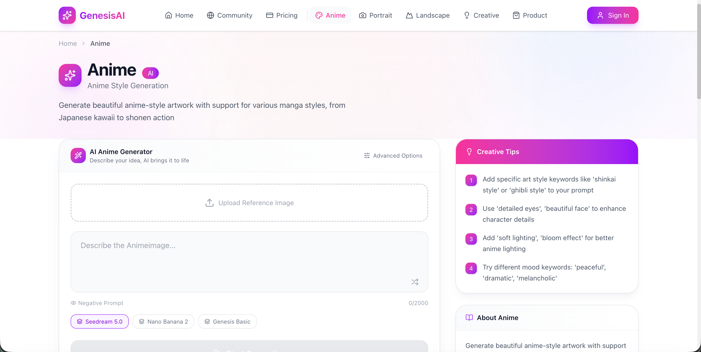
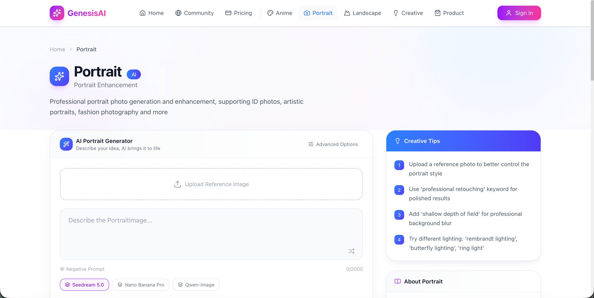
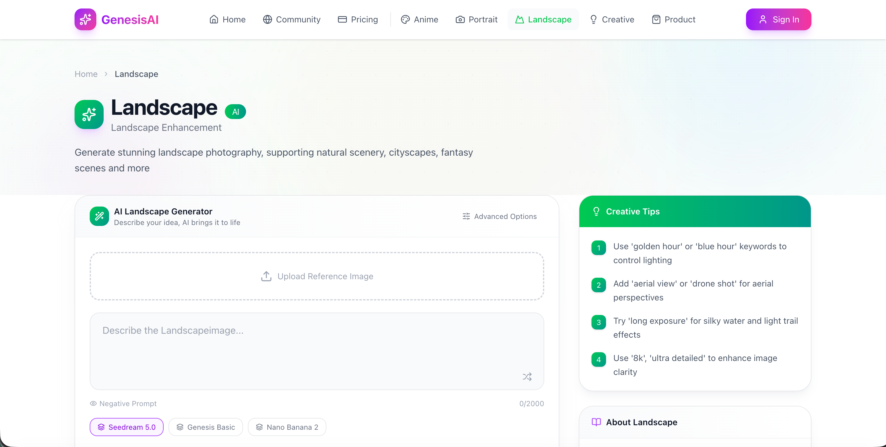
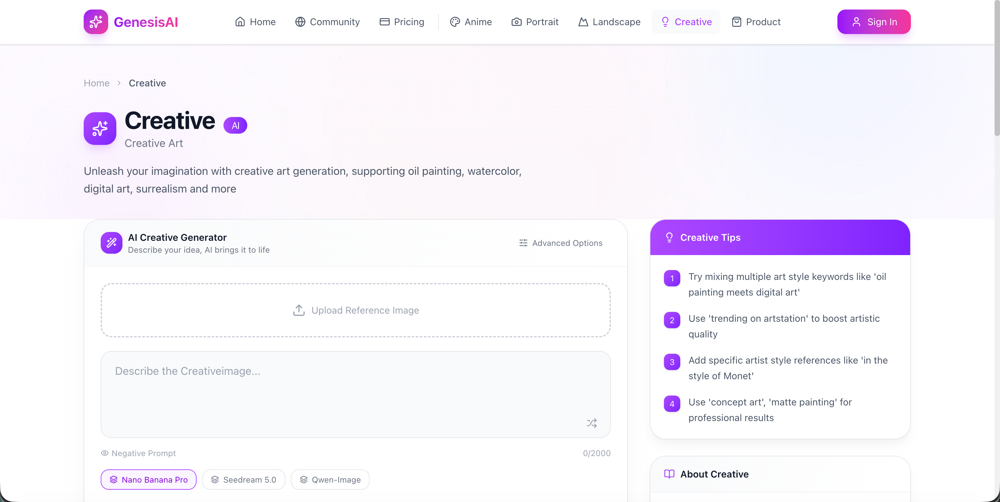
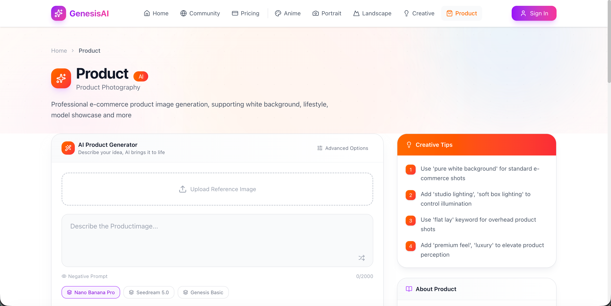
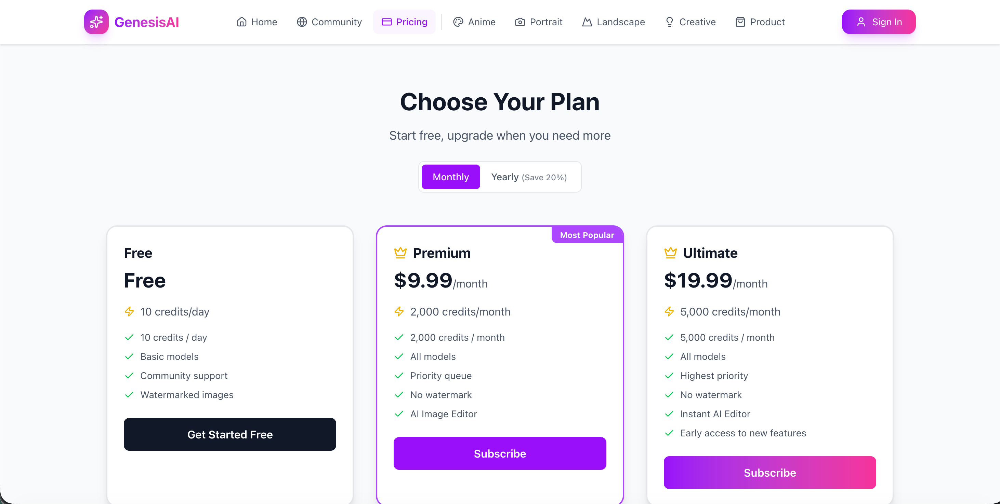
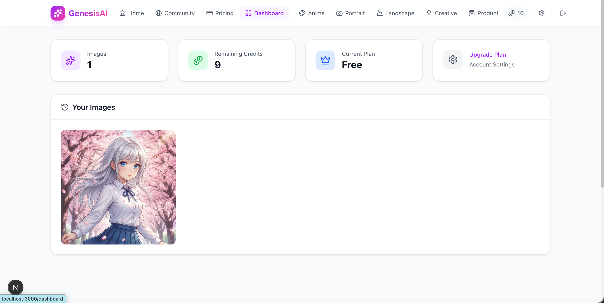
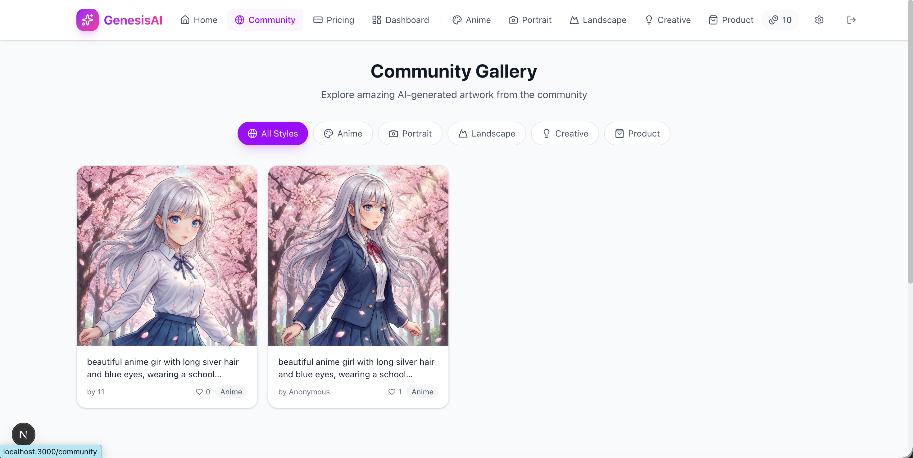

# 🎨 AI Image Generator

> A professional, full-stack AI image generation platform with multi-style artistic creation, community sharing, and subscription-based payment system.

<div align="center">

[](https://nextjs.org/)
[](https://react.dev/)
[](https://www.typescriptlang.org/)
[](https://tailwindcss.com/)
[](https://www.prisma.io/)
[](https://authjs.dev/)
[](./LICENSE)

</div>

---

## 📸 Screenshots

### Home Page


### AI Generation - Anime Style


### AI Generation - Portrait Enhancement


### AI Generation - Landscape Enhancement


### AI Generation - Creative Art


### AI Generation - Product Image


### Pricing Plans


### User Dashboard


### Community Gallery


> **Tip:** Take screenshots of each page at `http://localhost:3000` and save them to the `assets/` folder with the filenames shown above.

---

## ✨ Features

### 🎨 AI-Powered Generation
- **5 Artistic Styles** — Anime, Portrait Enhancement, Landscape Enhancement, Creative Art, Product Image
- **Hidden System Prompts** — Each style has optimized system prompts for professional results
- **Multiple Models** — Configurable AI models per style (Stability AI / Replicate / OpenAI)
- **Real-time Progress** — SSE streaming for live generation status updates
- **Reference Images** — Upload reference images to guide AI generation

### 👤 User System
- **Google OAuth Login** — Secure one-click sign in with Google accounts
- **Credit System** — Free daily credits + premium subscription credits
- **User Dashboard** — View, download, delete generated images
- **Image History** — Full generation history with prompts and timestamps

### 🌐 Community
- **Public Gallery** — Share your generations with the community
- **Style Filtering** — Browse community works by artistic style
- **One-Click Publish** — Toggle images between private and public

### 💰 Monetization
- **Subscription Plans** — Free, Premium, and Ultimate tiers
- **Paddle Payments** — MoR (Merchant of Record) with webhook verification
- **Monthly/Yearly Billing** — Flexible billing cycles with annual discount

### 🛡️ Security
- **Server-side API Keys** — AI keys never exposed to client
- **NextAuth Sessions** — Encrypted JWT-based authentication
- **Paddle Signature Verification** — Timing-safe webhook validation
- **Rate Limiting** — API protection against abuse
- **Zod Validation** — Schema-based input validation
- **User Authorization** — Users can only access their own data

---

## 🚀 Quick Start

### Prerequisites

- **Node.js** 18+
- **npm** 9+

### 1. Clone & Install

```bash
git clone <your-repo-url>
cd image-generate
npm install
```

### 2. Environment Setup

```bash
cp .env.example .env.local
```

Edit `.env.local` with your credentials:

```env
# Database
DATABASE_URL="file:./dev.db"

# NextAuth
NEXTAUTH_URL="http://localhost:3000"
NEXTAUTH_SECRET="your-secret-here"

# Google OAuth
GOOGLE_CLIENT_ID="your-google-client-id"
GOOGLE_CLIENT_SECRET="your-google-client-secret"

# Paddle Payments
PADDLE_VENDOR_ID="your-paddle-vendor-id"
PADDLE_API_KEY="your-paddle-api-key"
PADDLE_PUBLIC_KEY="your-paddle-public-key"
PADDLE_WEBHOOK_SECRET="your-paddle-webhook-secret"
PADDLE_ENV="sandbox"

# AI API (at least one required)
STABILITY_API_KEY="your-stability-api-key"
```

### 3. Database Setup

```bash
npm run db:push
```

### 4. Start Dev Server

```bash
npm run dev
```

Open [http://localhost:3000](http://localhost:3000) in your browser.

---

## 📁 Project Structure

```
image-generate/
├── assets/                        # Screenshots and static assets
├── prisma/
│   ├── schema.prisma              # Database schema (User, Image, Order, Plan)
│   └── seed.ts                    # Database seeder
├── src/
│   ├── app/
│   │   ├── api/
│   │   │   ├── auth/[...nextauth]/ # NextAuth v5 handler
│   │   │   ├── credits/            # Credits management API
│   │   │   ├── generate/           # SSE image generation API
│   │   │   ├── images/
│   │   │   │   ├── route.ts        # Image CRUD + community query
│   │   │   │   └── [id]/route.ts   # Image publish/delete
│   │   │   └── paddle/
│   │   │       ├── products/       # Paddle product listings
│   │   │       └── webhook/        # Paddle webhook handler
│   │   ├── auth/error/             # Auth error page
│   │   ├── dashboard/              # User dashboard page
│   │   ├── generate/
│   │   │   ├── anime/              # Anime style generation
│   │   │   ├── portrait/           # Portrait enhancement
│   │   │   ├── landscape/          # Landscape enhancement
│   │   │   ├── creative/           # Creative art generation
│   │   │   └── product/            # Product photography
│   │   ├── pricing/                # Subscription pricing page
│   │   ├── signin/                 # Sign in page
│   │   ├── layout.tsx              # Root layout
│   │   └── page.tsx                # Home page
│   ├── components/
│   │   ├── providers/              # SessionProvider
│   │   ├── Header.tsx              # Global navigation bar
│   │   ├── Footer.tsx              # Global footer
│   │   ├── StyleGeneratorPage.tsx  # Shared generation page component
│   │   └── ImageGenerator.tsx      # Legacy generator component
│   └── lib/
│       ├── auth.ts                 # NextAuth configuration
│       ├── db.ts                   # Prisma client singleton
│       ├── styles.ts               # Style configurations & system prompts
│       └── rate-limit.ts           # Rate limiting utility
├── .env.example                    # Environment template
├── next.config.ts                  # Next.js configuration
├── package.json
├── tailwind.config.ts
└── tsconfig.json
```

---

## 🎨 Style Configurations

Each AI generation style has its own optimized configuration defined in [src/lib/styles.ts](./src/lib/styles.ts):

| Style | Route | System Prompt Theme | Color |
|-------|-------|-------------------|-------|
| Anime | `/generate/anime` | High-quality anime illustration | Pink → Purple |
| Portrait | `/generate/portrait` | Professional portrait enhancement | Rose → Pink |
| Landscape | `/generate/landscape` | Natural landscape enhancement | Emerald → Teal |
| Creative | `/generate/creative` | Artistic creative expression | Purple → Indigo |
| Product | `/generate/product` | E-commerce product photography | Blue → Cyan |

---

## 🗄️ Database Models

| Model | Description |
|-------|-------------|
| **User** | User accounts with credits, subscription tier, and OAuth info |
| **Image** | Generated images with prompt, style, URL, and publish status |
| **Order** | Payment transaction records from Paddle |
| **Plan** | Subscription plan definitions (Free / Premium / Ultimate) |
| **Account** | NextAuth OAuth provider accounts |
| **Session** | NextAuth user sessions |
| **VerificationToken** | NextAuth verification tokens |

---

## 🔧 Available Scripts

| Script | Description |
|--------|-------------|
| `npm run dev` | Start development server with Turbopack |
| `npm run build` | Generate Prisma client + build for production |
| `npm run start` | Start production server |
| `npm run lint` | Run ESLint |
| `npm run db:push` | Push schema to database |
| `npm run db:studio` | Open Prisma Studio GUI |
| `npm run db:migrate` | Create and apply migrations |
| `npm run db:seed` | Seed database with default plans |

---

## 🔌 External Services Setup

### Google OAuth
1. Visit [Google Cloud Console](https://console.cloud.google.com/apis/credentials)
2. Create OAuth 2.0 credentials
3. Add redirect URI: `http://localhost:3000/api/auth/callback/google`
4. Copy Client ID and Secret to `.env.local`

### Paddle Payments
1. Sign up at [Paddle](https://vendors.paddle.com)
2. Get Vendor ID, API Key, and Public Key from sandbox settings
3. Create products with monthly/yearly price IDs
4. Configure webhook: `https://your-domain.com/api/paddle/webhook`
5. Set webhook secret for signature verification

### AI APIs
- **[Stability AI](https://platform.stability.ai)** — Recommended for general image generation
- **[Replicate](https://replicate.com)** — Alternative with diverse model options
- **[OpenAI DALL·E](https://platform.openai.com)** — DALL·E image generation

---

## 🚢 Deployment

### Vercel (Recommended)
```bash
vercel deploy
```
Set all environment variables in Vercel dashboard. Change `DATABASE_URL` to a production PostgreSQL connection.

### Self-Hosted
```bash
npm run build
npm run start
```
Requires PostgreSQL for production database.

---

## 📄 License

MIT © AI Image Generator